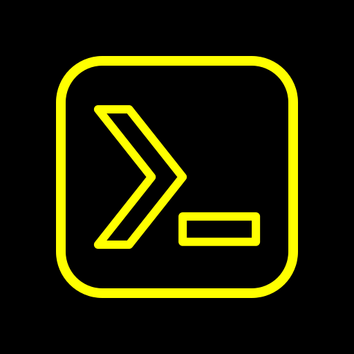

<div align="center">



# 白い熊 Termux

**The Termux terminal and Linux environment, with its plugins folded in, styled from one page, and backed up whole.**

A fork of [Termux](https://github.com/termux/termux-app) with **major additions**: the **白い熊 Termux UI** page (colours, schemes and fonts with live preview — Termux:Styling absorbed — plus the extra keys, drawer, toolbar, dialogs and menus), **Export / Import** that backs up the entire prefix (`~` and `$PREFIX` as tars inside one zip, restorable into a fresh install), the sister-app **backup-automation contract**, and **Termux:Boot, Termux:Widget and Termux:Float absorbed** into the app — the floating terminal is a long-press away on the launcher icon.

Installs **over** the stock Termux (app id `com.termux` kept so the Termux package ecosystem keeps working); the whole family — Termux, Termux API, Termux X11, Termux GUI and 白い熊 GNU Emacs — shares Android UID `com.termux` and is signed with one key, so every member must come from these forks.

**📥 Latest release: [`0.118.0+2026-09-11.22-27.g45844885+008`](https://github.com/ShiroiKuma0/shiroikuma-termux/releases/latest)** — [all releases & APK downloads »](https://github.com/ShiroiKuma0/shiroikuma-termux/releases)

</div>

---

## 🎨 白い熊 Termux UI — the whole look on one page

Long-press the drawer's gear (or pick **白い熊 Termux UI** from the terminal's context menu, the first row of Settings, or the launcher shortcut) and every visible surface of the app is in front of you, **previewing live on the terminal behind the translucent page** as you drag a slider or pick a colour.

- **Terminal** — background, foreground and cursor pickers (a four-slider ARGB picker with recent swatches), a **Colour scheme** list with all 114 termux-styling schemes plus the house black-and-yellow one, a **Font** list with its own glyph preview (Cascadia Code, Fantasque Sans Mono, Fira Code and Meslo bundled; *Add font…* imports any `.ttf`/`.otf` into `~/.termux/fonts`), and a font-size slider. Everything is written to Termux's own `~/.termux/colors.properties` and `font.ttf`, so the terminal itself stays stock.
- **Extra keys row** — background, text, active colours, text size, border and corner radius, applied to every button as the row is rebuilt.
- **Drawer / sessions** — drawer background, button text, icon tint, session text, selected-session background, dead-session text, text size.
- **Toolbar / status bar** — the toolbar, status-bar and navigation-bar colours of Settings, Help, Report and our own page.
- **Dialogs / menus** — background, text, title, button and border/corner styling for our dialogs, the terminal's context menu and the text-selection toolbar (COPY · PASTE · MORE…, replaced by one of ours because the platform's cannot be themed); upstream's platform dialogs and the Settings screens get the black-and-yellow overlay too.
- **Widget** and **Floating terminal** — the absorbed plugins' colours and frames, restyled on every placed widget and on a running floating window.
- Long-press any colour or size row to return it to the house default; **Reset** clears the page, the colour file and the font in one go.

Termux:Styling is thereby absorbed: its schemes and fonts ship inside the app, and the *Style* slot of the context menu opens this page.

---

## 💾 Export / Import — the whole prefix in one zip

**Export / Import…** is the first row of the page. One `shiroikuma-termux_<yyyy-MM-dd_HH-mm-ss>.zip` in a directory you choose holds:

- **Settings** — the app preferences, `termux.properties`, `colors.properties`, `font.ttf` and your imported fonts;
- **Home** — `/data/data/com.termux/files/home` as `data/home.tar`;
- **Packages** — `$PREFIX` (`files/usr`) as `data/usr.tar`.

The tars are built in Java (modes, owners, mtimes, symlinks and hard links preserved; sockets and FIFOs skipped and counted), stored uncompressed inside a Zip64 archive so `unzip -p backup.zip data/home.tar | tar t` just works. **Import** streams the same zip back: settings merge in, the trees are unpacked into staging, then — only after the last byte has been read and verified — every process of the UID is stopped and the trees are swapped in atomically. A truncated archive never touches live data; a free-space check runs first. Restore into a **fresh install before the first launch** and Termux boots straight into the restored prefix instead of extracting the bootstrap. Category checkboxes (`settings`, `data`, `data.home`, `data.usr`) let you back up or restore any subset; the import ends with *Later* / *Restart now*.

---

## 🤖 Backup automation — 保存復元 can do it for you

The sister-app **backup-automation contract v2** is implemented in full, so 保存復元 (the shiroikuma-jiyusagyoban automation) backs 白い熊 Termux up unattended, prefix and all:

- an exported broadcast door — `com.termux.action.EXPORT_STATE`, `LIST_CATEGORIES`, `CANCEL_EXPORT` — with a reply broadcast per request (`OK:<path>|<bytes>|<size>|<n> categories` or `ERROR:<reason>`);
- a content provider at `com.termux.automation` with `describe` / `export` / `import` / `cancel`, streaming to and from a file descriptor for pinned callers only;
- every run in a foreground `dataSync` service with a notification, progress broadcasts (files and bytes, a heartbeat every 20 s) and cancellation;
- an **Automation export** switch and an optional **authorization token** (tap to copy, *Regenerate* to rotate) on the UI page.

---

## 🧩 Boot, Widget and Float — absorbed, no plugin APKs

The three plugins now live inside the app, ported at their recorded upstream commits and sharing the app's process, preferences and look:

- **Termux:Boot** — scripts in `~/.termux/boot/` run at boot once the app has been opened once after install.
- **Termux:Widget** — the `~/.shortcuts` home-screen widget (coloured and sized from the UI page), the launcher's *Create shortcut* picker, dynamic shortcuts on the app icon, and Android 11+ **Device Controls**.
- **Termux:Float** — the **floating terminal**, opened from the *Floating terminal* launcher shortcut or the UI page; its frame colour, border and corner radius and its notification text are yours to set, and a running window restyles live.

No second launcher icon appears for any of them. **Uninstall the standalone Termux:Boot / Widget / Float apps** when you install this build — they share the UID and the same `~/.termux/boot` and `~/.shortcuts`, so with both present every boot script runs twice and the launcher offers each widget twice.

---

## 🐻 Our icon and our name

The launcher icon is a traced **`>_` prompt in a rounded square — yellow line art on black** (adaptive foreground, legacy mipmaps and the store icon all generated from `design/shiroikuma-termux-icon.svg` by `tools/icon/emit_launcher.py`). The app is **白い熊 Termux** everywhere it names itself — launcher label, notification channels, crash reports — and its About page links point at this fork and at 白い熊 Termux API, while the manual links stay on the Termux wiki. The donate row is gone.

---

## 🔑 One family, one key

`com.termux` is not a name we can change: every binary in the bootstrap and on packages.termux.dev hardcodes `/data/data/com.termux/files/usr`, and Termux API, the Termux X11 loader and every Termux GUI client hardcode `com.termux.*`. So the app id, namespace and `sharedUserId` stay `com.termux`, the fork installs **over** stock Termux, and the whole shared-UID family is signed with **one** key — Android refuses a `sharedUserId` app whose signature differs from the ones already installed. A stock Play/F-Droid/GitHub Termux must be uninstalled first (its `$PREFIX` and `$HOME` go with it; back them up from inside Termux beforehand, and restore them with **Import** afterwards).

### Family

- [shiroikuma-termux](https://github.com/ShiroiKuma0/shiroikuma-termux) — 白い熊 Termux (this app)
- [shiroikuma-termux-api](https://github.com/ShiroiKuma0/shiroikuma-termux-api) — 白い熊 Termux API
- [shiroikuma-termux-x11](https://github.com/ShiroiKuma0/shiroikuma-termux-x11) — 白い熊 Termux X11
- [shiroikuma-termux-gui](https://github.com/ShiroiKuma0/shiroikuma-termux-gui) — 白い熊 Termux GUI
- [shiroikuma-emacs](https://github.com/ShiroiKuma0/shiroikuma-emacs) — 白い熊 GNU Emacs (`shiroikuma.emacs`, side-by-side with stock `org.gnu.emacs`, same shared UID)

---

## Versioning

`custom` is rebased onto every commit of upstream's `master`, so the version pins the upstream commit each release is built on: `<upstream version>+<upstream base date>.<HH-MM>.g<sha8>+<NNN>` — e.g. `0.118.0+2026-09-11.22-27.g45844885+006` is upstream `0.118.0`'s branch at `45844885` (committed 2026-09-11 22:27 UTC) with our build counter at 006. `versionCode` = upstream code × 10000 + N, so every build installs as an upgrade. Tags carry the same string, without a `v`.

---

## Built on Termux

A fork of [Termux](https://github.com/termux/termux-app) (app id `com.termux` kept, so it replaces the official build rather than coexisting with it). Termux is the Android terminal emulator and Linux environment that brings a full command-line to a phone with no rooting — the terminal, the bootstrap and the package ecosystem are theirs, and this fork carries upstream's `master` forward commit by commit. The **manual** is the [Termux wiki](https://wiki.termux.com); packages come from [termux/termux-packages](https://github.com/termux/termux-packages) (see [Package Management](https://github.com/termux/termux-packages/wiki/Package-Management) for `pkg`/`apt` questions), and the notes on Android 12+ phantom-process killing in upstream's [issue #2366](https://github.com/termux/termux-app/issues/2366) apply unchanged. The code remains under [GPLv3](LICENSE.md), with upstream's listed exceptions.

## Building

JDK 21, the Android SDK with `compileSdk 36` and NDK `29.0.14206865` exactly; `targetSdk` stays at upstream's 28 on purpose (Android 10+ W^X rules). The first build downloads the four bootstrap zips and runs ndk-build for four ABIs plus R8 — expect ten minutes or more; warm builds take a minute or two.

```bash
git clone https://github.com/ShiroiKuma0/shiroikuma-termux.git
cd shiroikuma-termux                      # branch custom

# Signing: app/shiroikuma.gradle reads the gitignored keystore.properties at the repo root —
# copy keystore.properties_sample to keystore.properties and point it at your keystore.
# buildFork refuses to run without it (an unsigned APK cannot install over the signed family).
cp keystore.properties_sample keystore.properties

export JAVA_HOME=/usr/lib/jvm/java-21-openjdk-amd64   # Gradle 9 needs JDK 21
export ANDROID_HOME=$HOME/android-sdk                  # or sdk.dir=… in local.properties

# Signed universal release → ~/tmp/shiroikuma-termux_<versionName>_universal.apk, then BUILD_NUMBER is bumped
./gradlew buildFork --console=plain < /dev/null

# Release APK only (no copy, no bump) — the toolchain test
./gradlew :app:assembleRelease --console=plain < /dev/null

# What the next build will be called
./gradlew :app:versionName -q < /dev/null
```

`buildFork` also refuses a `versionCode` that does not exceed the last one it built (`LAST_BUILT_VERSION_CODE` in `gradle.properties`) — raise `BUILD_NUMBER`, never lower it. `./gradlew :app:assembleDebug` gives a debug-signed split set for compile checks and the emulator; it will not install over the signed family.
